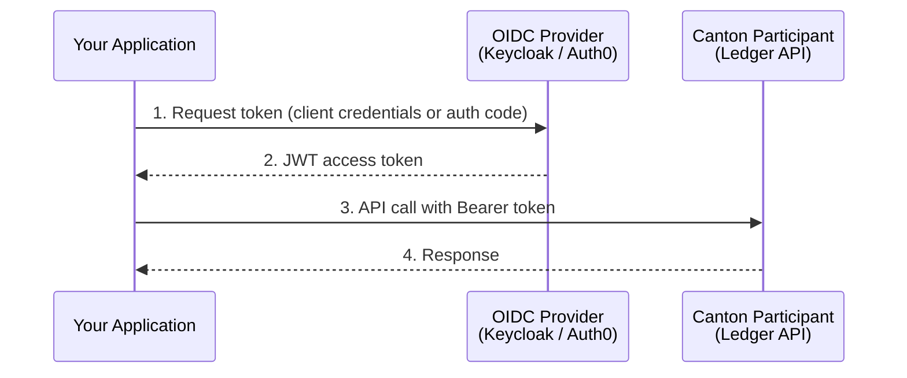

# CBTC Authentication: JWT, Keycloak, and Auth0 Setup Guide

Responsible: Max Webster-Dowsing
Created: February 10, 2026 4:31 PM
Created By: Max Webster-Dowsing
Last Edited: February 11, 2026 10:12 PM
Last Edited By: Max Webster-Dowsing
Pillars: CBTC (https://www.notion.so/CBTC-2c3636dd0ba580cf8739cd330148f78a?pvs=21)
Priority Level: High
Product: CBTC
Projects: CBTC Documentation Overhaul (https://www.notion.so/CBTC-Documentation-Overhaul-56ac9d22e884416f8f5db5bb7ead1d04?pvs=21)
Status: In Review
Status Update: Not started
Type: Guide

<aside>
👥

**Audience:** App Developers and Infrastructure Integrators setting up authentication for Canton Ledger API access.

</aside>

<aside>
⚠️

**API Disclaimer:** CBTC APIs are subject to change. Authentication flows may evolve as Canton's identity layer matures.

</aside>

---

## Overview: How Authentication Works for CBTC on Canton

All CBTC operations go through the Canton Ledger API, which requires a valid **JWT (JSON Web Token)** for every request. The JWT is issued by an **OIDC (OpenID Connect) provider** connected to your Canton participant node.

This guide covers two authentication options for developers building with CBTC and the Canton Network:

- **Keycloak** (officially supported by BitSafe)
- **Auth0** (community example, not officially maintained)

---

## CBTC Authentication Flow: JWT and OIDC



---

## Set Up Keycloak for CBTC Authentication (Officially Supported) ✅

Keycloak is the **officially supported** OIDC provider for CBTC integrations. BitSafe engineering provides support for Keycloak-based authentication.

### Prerequisites

- Keycloak instance running and accessible
- A realm configured for your Canton participant
- A client application registered in Keycloak

### Step 1: Register a Client

In your Keycloak admin console:

1. Navigate to your realm → **Clients** → **Create client**
2. Set **Client type** to `OpenID Connect`
3. Set **Client ID** (e.g., `cbtc-minting-app`)
4. Enable **Client authentication** (for server-to-server flows)
5. Under **Service account roles**, enable as needed

### Step 2: Configure Your Canton Participant

Your Canton participant must be configured to trust your Keycloak instance. In your participant configuration:

```
canton {
  participants {
    participant1 {
      ledger-api {
        auth-services = [{
          type = jwt-rs-256-jwks
          url = "https://<your-keycloak>/realms/<your-realm>/protocol/openid-connect/certs"
        }]
      }
    }
  }
}
```

### Step 3: Obtain a Token

**Client Credentials flow** (for server-to-server / backend integrations):

```bash
curl -X POST "https://<your-keycloak>/realms/<your-realm>/protocol/openid-connect/token" \
  -H "Content-Type: application/x-www-form-urlencoded" \
  -d "grant_type=client_credentials" \
  -d "client_id=cbtc-minting-app" \
  -d "client_secret=$CLIENT_SECRET"
```

**Response:**

```json
{
  "access_token": "eyJhbGciOiJSUzI1NiIs...",
  "expires_in": 300,
  "token_type": "Bearer"
}
```

### Step 4: Use the Token

Include the token in all Canton Ledger API calls:

```bash
curl -X POST "https://<your-participant>/v2/state-queries" \
  -H "Authorization: Bearer $ACCESS_TOKEN" \
  -H "Content-Type: application/json" \
  -d '{ ... }'
```

### Token Refresh

Tokens expire (typically 5 minutes for Keycloak). Your application should:

1. Cache the token until near expiry
2. Request a new token before the current one expires
3. Retry failed requests with a fresh token if you receive a `401`

---

## Set Up Auth0 for CBTC Authentication (Community Example) ⚠️

<aside>
💡

**Auth0 compatibility.** Both Keycloak and Auth0 follow the OAuth2/OIDC standard, so the login flow and token usage are identical. There is one known caveat: Auth0 requires an extra `audience` parameter in the token request. The `cbtc-lib` and `canton-lib` libraries **do not pass this parameter by default**, so they won't work out of the box with Auth0. This is a straightforward fix on either the library side or the client side. See the workaround below.

BitSafe engineering support covers **Keycloak-based authentication only**. For Auth0-specific configuration issues, refer to [Auth0's documentation](https://auth0.com/docs).

</aside>

### Prerequisites

- Auth0 tenant and API configured
- Application registered as **Machine to Machine** (for backend) or **Single Page Application** (for frontend)

### Step 1: Create an Auth0 API

In the Auth0 dashboard:

1. Navigate to **Applications** → **APIs** → **Create API**
2. Set **Name** (e.g., `Canton Ledger API`)
3. Set **Identifier** to your participant's Ledger API URL
4. Set **Signing Algorithm** to `RS256`

### Step 2: Register a Machine-to-Machine Application

1. Navigate to **Applications** → **Create Application**
2. Select **Machine to Machine Applications**
3. Authorise the application to call your Canton Ledger API
4. Note the **Client ID** and **Client Secret**

### Step 3: Configure Your Canton Participant

Point your participant to Auth0's JWKS endpoint:

```
canton {
  participants {
    participant1 {
      ledger-api {
        auth-services = [{
          type = jwt-rs-256-jwks
          url = "https://<your-auth0-domain>/.well-known/jwks.json"
        }]
      }
    }
  }
}
```

### Step 4: Obtain a Token

```bash
curl -X POST "https://<your-auth0-domain>/oauth/token" \
  -H "Content-Type: application/json" \
  -d '{
    "client_id": "'$CLIENT_ID'",
    "client_secret": "'$CLIENT_SECRET'",
    "audience": "https://<your-participant>/v2/",
    "grant_type": "client_credentials"
  }'
```

<aside>
⚠️

**The `audience` parameter is required for Auth0.** This is the key difference from Keycloak. Without it, Auth0 will return an opaque token that the Canton participant will reject. Set `audience` to your participant's Ledger API base URL.

**If using cbtc-lib / canton-lib:** The Rust libraries' `keycloak::login::password` and `keycloak::login::client_credentials` functions do not pass an `audience` parameter. To use Auth0, you'll need to either:

1. Make the token request directly via HTTP (as shown above) instead of using the library helpers
2. Patch the login functions to include the `audience` field, which is a small change

A library-level fix may be shipped in a future release of `canton-lib`.

</aside>

### Step 5: Use the Token

Same as Keycloak. Include the Bearer token in all API requests.

---

## Wallet-Based Authentication for Canton dApps

For applications that use Canton-compatible wallets (Loop, Console/Zoro, Bron), authentication is handled by the wallet provider. Your application receives a JWT through the wallet's SDK or connect flow.

Supported wallets:

- **Loop Wallet**
- **Console / Zoro Wallet**
- **Bron Wallet**
- **WalletConnect** (for dApp integrations)
- **Node login** (direct participant authentication)

See the **Integration Guides** for wallet-specific connection patterns.

---

## Troubleshooting

| Issue | Cause | Resolution |
| --- | --- | --- |
| `401 Unauthorized` on every request | JWT not trusted by participant | Verify JWKS URL in participant config matches your OIDC provider |
| Token expires immediately | Clock skew between OIDC provider and participant | Sync system clocks (NTP) |
| CORS errors in browser | Ingress not configured for CORS | Add CORS annotations to your ingress — see Minting App Installation Guide |
| `invalid_grant` from OIDC provider | Client secret rotated or incorrect | Regenerate and update client secret |

---

## JWT Security Best Practices for Canton Applications

- **Never expose client secrets** in frontend code. Use the Client Credentials flow only from backend services.
- **Rotate secrets regularly.** Update client secrets in both your OIDC provider and your application config.
- **Use short-lived tokens.** The default 5-minute expiry is appropriate for most use cases.
- **Restrict party access.** Configure your JWT claims to limit which Canton parties a token can act as.

---

<aside>
🔴

**⚙️ Engineering Review Required**

Authentication configuration details (especially Canton participant config syntax and JWKS integration) must be validated by Engineering (Jesse or Robert) before publication. The Auth0 community example should also be reviewed for accuracy.

</aside>