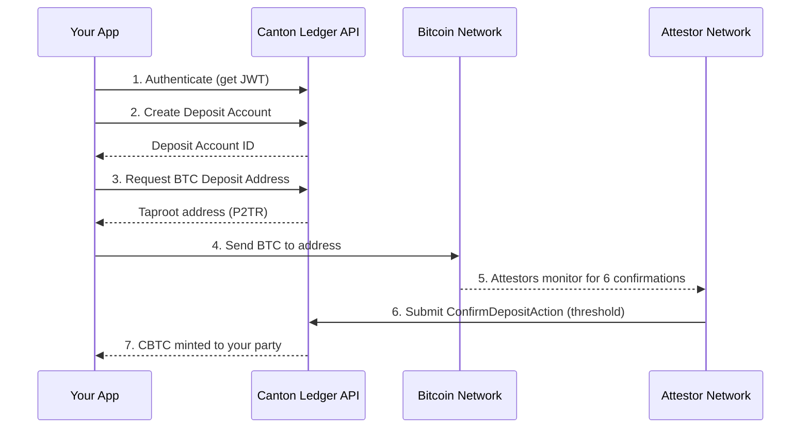
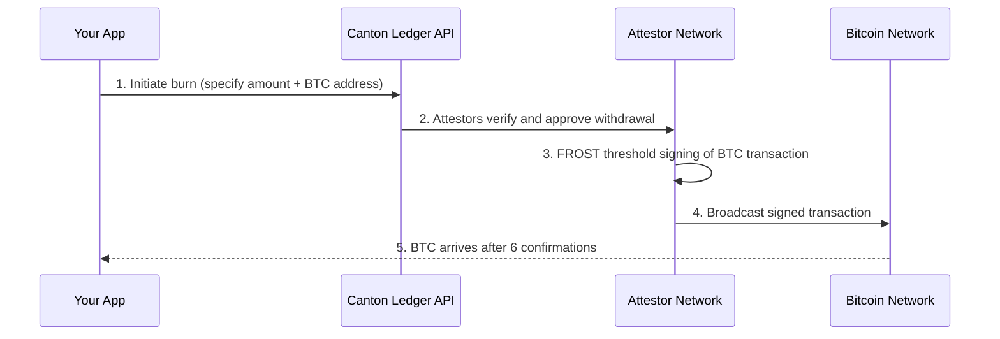

<aside>
👥

**Audience:** App Developers and Infrastructure Integrators building minting or redemption flows into their applications.

</aside>

<aside>
⚠️

**API Disclaimer:** CBTC APIs are subject to change. There is no formal versioning policy today. Breaking changes are communicated via #cbtc-ecosystem and the site changelog. All code examples require Engineering validation before production use.

</aside>

---

## Overview: The Full BTC to CBTC Lifecycle

This guide covers the complete lifecycle of converting Bitcoin to CBTC and back: minting (BTC to CBTC on Canton) and burning (CBTC back to BTC). For a quick end-to-end walkthrough, see the **CBTC Quick Start**. This guide goes deeper into each step, covering edge cases, error handling, and recovery patterns for production integrations.

**Key facts:**

- **Exchange rate:** 1 BTC = 1 CBTC, always
- **Confirmations required:** 6 Bitcoin block confirmations (~60 minutes)
- **Processing time:** Additional 60–120 seconds after confirmations for Attestor verification
- **Wallet requirement:** Taproot-compatible Bitcoin wallet (P2TR addresses)
- **Minimum amount:** 0.001 BTC

---

## How to Mint CBTC: Deposit Bitcoin and Receive Wrapped BTC on Canton

### How It Works



### Step-by-Step

#### Step 1: Authenticate

Obtain a JWT token from your OIDC provider (Keycloak is officially supported). See the **Authentication Guide** for setup details.

#### Step 2: Create a Deposit Account

A Deposit Account is required before you can generate deposit addresses.

**Using cbtc-lib (Rust):**

```rust
use cbtc_lib::deposit::create_deposit_account;

let deposit_account = create_deposit_account(
    &ledger_client,
    &party_id,
).await?;

println!("Deposit Account ID: {}", deposit_account.contract_id);
```

**Using Canton API (curl):**

```bash
# Replace with your actual Ledger API URL and JWT
curl -X POST "https://<your-participant>/v2/commands" \
  -H "Authorization: Bearer $JWT" \
  -H "Content-Type: application/json" \
  -d '{
    "commands": [{
      "createCommand": {
        "templateId": "CBTC.Issuance:DepositAccount",
        "createArguments": {
          "owner": "'$PARTY_ID'"
        }
      }
    }]
  }'
```

#### Step 3: Generate a Bitcoin Deposit Address

Each deposit address is unique to your account and is a standard **Taproot (P2TR)** address.

**Using cbtc-lib (Rust):**

```rust
use cbtc_lib::deposit::request_deposit_address;

let address = request_deposit_address(
    &ledger_client,
    &deposit_account_id,
).await?;

println!("Send BTC to: {}", address.btc_address);
```

<aside>
⚠️

**Important:** Only send Bitcoin from addresses you control. Each generated address is unique to your deposit account. Sending from an exchange or shared wallet may result in attribution issues.

</aside>

#### Step 4: Send Bitcoin

Send the exact amount of BTC you want to mint as CBTC to the generated Taproot address from your Bitcoin wallet.

#### Step 5: Wait for Confirmations

The Attestor network automatically monitors the Bitcoin network. Once your transaction reaches **6 confirmations** (~60 minutes), it transitions to the processing state.

You can poll for deposit status:

**Using cbtc-lib (Rust):**

```rust
use cbtc_lib::deposit::get_pending_deposits;

let deposits = get_pending_deposits(
    &ledger_client,
    &party_id,
).await?;

for deposit in deposits {
    println!("Status: {} | Confirmations: {}/6", 
        deposit.status, deposit.confirmations);
}
```

#### Step 6: Attestor Verification

This step is fully automated. The Attestor network:

1. Independently verifies the Bitcoin transaction has 6+ confirmations
2. Each Attestor submits a `ConfirmDepositAction` to the Canton governance module
3. Once the required threshold of confirmations is reached, the Coordinator executes the mint

**No action is required from your application during this step.**

#### Step 7: CBTC Available

Your CBTC is minted and available in your Canton party. Check your balance:

**Using cbtc-lib (Rust):**

```rust
use cbtc_lib::balance::get_cbtc_balance;

let balance = get_cbtc_balance(&ledger_client, &party_id).await?;
println!("CBTC Balance: {}", balance);
```

---

## How to Burn CBTC: Redeem Wrapped Bitcoin for Native BTC

### How It Works



### Step-by-Step

#### Step 1: Initiate a Burn

Specify the amount of CBTC to burn and the Bitcoin address to receive your BTC.

**Using cbtc-lib (Rust):**

```rust
use cbtc_lib::withdraw::initiate_withdrawal;

let withdrawal = initiate_withdrawal(
    &ledger_client,
    &party_id,
    amount_satoshis,
    &btc_destination_address,
).await?;

println!("Withdrawal ID: {}", withdrawal.request_id);
```

#### Step 2: Attestor Verification and Signing

The Attestor network:

1. Verifies the burn request on Canton
2. Constructs the Bitcoin withdrawal transaction
3. Coordinates FROST threshold signing across Attestors
4. Once the signing threshold is met, broadcasts the signed transaction to the Bitcoin network

**This step is fully automated. No action required.**

#### Step 3: Bitcoin Delivery

After the signed transaction is broadcast, wait for 6 Bitcoin confirmations. Your BTC will arrive at the specified destination address.

---

## Error Handling and Recovery Patterns for CBTC Integrations

<aside>
🔧

**Error handling is critical for production integrations.** The CBTC system includes built-in resilience, but your application should handle these scenarios gracefully.

</aside>

### Failed Broadcast

The system includes **automatic retry logic**. If a Bitcoin transaction fails to broadcast initially, the Coordinator detects the failure during subsequent periodic checks (every 60–120 seconds) and rebroadcasts using stored transaction data.

**What your app should do:** Monitor withdrawal status. If status remains in `broadcasting` for more than 10 minutes, log an alert for investigation.

### Insufficient Confirmations

If a deposit stalls below 6 confirmations (e.g., due to Bitcoin network congestion), the system simply waits. There is no timeout.

**What your app should do:** Display the current confirmation count to the user. Consider showing an estimated time based on current Bitcoin block times.

### Idempotency

Each withdrawal generates a **unique transaction ID** that prevents accidental double-spending, even if network issues cause retry attempts. The system is designed to be idempotent.

**What your app should do:** Store the withdrawal request ID and use it for status checks rather than initiating duplicate requests.

### Attestor Timeout

If governance approval is delayed (e.g., some Attestors are temporarily offline), the system continues to collect approvals. As long as the threshold can eventually be met, the operation will complete.

**What your app should do:** If a mint or burn is pending for more than 2 hours, escalate to BitSafe support.

### Partial Failure

If some Attestors approve but the threshold is not reached (e.g., too many Attestors offline simultaneously), the operation will remain pending until the threshold is met or the situation is resolved.

**What your app should do:** Alert your operations team. Contact BitSafe engineering via #cbtc-ecosystem or [support@bitsafe.finance](mailto:support@bitsafe.finance).

---

## CBTC UTXO Management: Consolidation and Best Practices

<aside>
⚠️

**Important for high-volume integrations.** Each CBTC transfer creates UTXOs. Canton recommends a maximum of **10 UTXOs per party**. Exceeding this causes increased load and fees on your node.

</aside>

The cbtc-lib Rust library provides functions for managing UTXOs:

```rust
use cbtc_lib::utxo::consolidate_utxos;

// Consolidate UTXOs when count exceeds threshold
let result = consolidate_utxos(&ledger_client, &party_id).await?;
println!("Consolidated {} UTXOs", result.consolidated_count);
```

**Best practices:**

- Monitor UTXO count per party and consolidate proactively
- Batch transfers where possible to minimise UTXO creation
- If creating many parties, use the Ledger API directly (not wallet UI/API) — see [Canton docs](https://docs.digitalasset.com/build/3.4/tutorials/json-api/canton_and_the_json_ledger_api_ts.html#allocating-a-party)

---

## Escalation Path

| Situation | Action |
| --- | --- |
| Mint pending > 2 hours | Check Bitcoin confirmations first. If 6+ confirmations reached, contact BitSafe |
| Burn pending > 2 hours | Contact BitSafe engineering |
| Unexpected error from API | Retry with exponential backoff. If persistent, contact BitSafe |
| UTXO-related issues | Use cbtc-lib consolidation functions. If unresolved, contact BitSafe |

**Support channels:**

- **Slack:** #cbtc-ecosystem
- **Email:** [support@bitsafe.finance](mailto:support@bitsafe.finance)

---

<aside>
🔴

**⚙️ Engineering Review Required**

All code examples in this document must be validated by Engineering (Jesse or Ferenc) against the actual cbtc-lib source and Canton Ledger API before publication. Function signatures, parameter names, and response shapes may differ from the current implementation.

</aside>