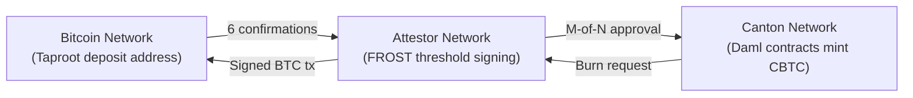

# CBTC Overview: Wrapped Bitcoin on the Canton Network

Responsible: Max Webster-Dowsing
Created: February 10, 2026 4:31 PM
Created By: Max Webster-Dowsing
Last Edited: February 24, 2026 4:42 PM
Last Edited By: Gyorgy Balazsi
Pillars: CBTC (https://www.notion.so/CBTC-2c3636dd0ba580cf8739cd330148f78a?pvs=21)
Priority Level: High
Product: CBTC
Projects: CBTC Documentation Overhaul (https://www.notion.so/CBTC-Documentation-Overhaul-56ac9d22e884416f8f5db5bb7ead1d04?pvs=21)
Status: In Review
Status Update: Not started
Type: Guide

<aside>
👥

**Audience:** All developers, infrastructure integrators, and technical evaluators. Read this first before diving into specific guides.

</aside>

<aside>
⚠️

**API Disclaimer:** CBTC APIs are subject to change. There is no formal versioning policy today. Breaking changes are communicated via #cbtc-ecosystem and the site changelog.

</aside>

---

## What is CBTC? Bitcoin on the Canton Network

CBTC (Canton Bitcoin) is a **1:1 wrapped Bitcoin token** built on the [Canton Network](https://www.canton.network/), a privacy-first blockchain for institutional finance. Each CBTC is fully backed by native BTC held in decentralized custody using FROST threshold signatures. CBTC is **CIP-56 compliant**, meaning it works with any Canton token-standard-compatible tool out of the box.

CBTC brings Bitcoin's liquidity into Canton's privacy-enabled smart contract environment, where developers can build trading, DeFi, custody, and settlement applications without exposing positions to a public mempool. Unlike wrapped Bitcoin on public chains, CBTC transactions are private by default, eliminating MEV (Maximal Extractable Value) risks like front-running and sandwich attacks.

**Key properties:**

| Property | Value |
| --- | --- |
| **Backing** | 1 CBTC = 1 BTC, always |
| **Standard** | CIP-56 (Canton Instrument Protocol) |
| **Custody** | Decentralised via FROST threshold signatures (no single party can move reserves) |
| **Network** | Canton Network (permissioned, private transactions) |
| **Audit** | [Quantstamp audit report](https://certificate.quantstamp.com/full/cbtc/5d0d805e-8cf0-4a39-bf1a-0e94899b3c1c/index.html) |
| **Confirmations** | 6 Bitcoin block confirmations (~60 minutes) for minting |

---

## CBTC Architecture: How Wrapped Bitcoin Works on Canton

The CBTC system bridges Bitcoin's UTXO model to Canton's Daml-based smart contract network through three layers:

### 1. Bitcoin Layer

Bitcoin transactions are monitored and verified. A user sends BTC to a generated Taproot deposit address. The system waits for 6 block confirmations before proceeding.

### 2. Attester Network

A decentralised network of institutional-grade node operators independently verify Bitcoin deposits and withdrawals. Each Attester runs nodes on **both** the Bitcoin and Canton networks. Key details:

- **Operators:** Pre-screened institutional node operators (including providers like P2P and Everstake), each with over $1B in assets under management
- **Threshold:** A configurable M-of-N threshold of Attesters must approve every mint and burn operation
- **Coordination:** A Coordinator executes periodic checks (every 60–120 seconds), monitors deposit accounts, constructs Bitcoin transactions, and submits governance actions
- **No unilateral control:** No single party - including BitSafe or the Coordinator - can mint, burn, or move BTC without threshold approval

### 3. Canton Asset Layer

Daml contracts mint and burn CBTC tokens, but **only** after the required threshold of Attestor signatures is reached on the governance contract. CBTC is then held in the user's Canton party, fully under their control.

---

## Security Model: FROST Threshold Signatures for Bitcoin Custody

CBTC's security rests on **FROST** (Flexible Round-Optimised Schnorr Threshold Signatures), a cryptographic protocol added to Bitcoin with the Taproot upgrade.

**Why FROST matters for developers:**

- **Taproot-native:** Deposit addresses are standard P2TR addresses. Any wallet that supports Taproot can send BTC to mint CBTC.
- **Indistinguishable on-chain:** FROST signatures look identical to regular single-signature Bitcoin transactions. No one can tell from the blockchain that a threshold scheme is in use.
- **Smaller transactions, lower fees:** Compared to traditional on-chain multisig, FROST produces a single aggregated signature regardless of how many Attestors participated.
- **No single point of failure:** Even if some Attestors go offline, the system continues to operate as long as the threshold is met.

For a full technical deep dive, see the **Security Deep Dive** page. For the original research, see the [FROST whitepaper](https://eprint.iacr.org/2020/852).

---

## What You Can Build with Wrapped Bitcoin on Canton

CBTC is a foundational layer for building institutional-grade financial products on Canton:

- **DeFi Protocols** - DEXs, lending platforms, and liquidity pools using CBTC as collateral
- **Custody and Wallet Solutions** - Institutional-grade wallets supporting CBTC and Canton-native assets
- **Structured Products** - Yield-generating vaults, options strategies, and derivatives
- **Payment and Settlement** - Instant, low-cost cross-border transactions
- **Trading Systems** - Spot and perpetual trading with Canton's privacy (no public mempool, no MEV)

---

## Developer Resources

| Resource | Description | Link |
| --- | --- | --- |
| **cbtc-lib (Rust)** | SDK for minting, burning, sending, and receiving CBTC | [GitHub](https://github.com/DLC-link/cbtc-lib) |
| **canton-lib** | Lower-level Canton interaction library | [GitHub](https://github.com/DLC-link/canton-lib/) |
| **CBTC DAR files** | Daml packages to install on your Canton participant | [GitHub](https://github.com/DLC-link/cbtc-lib/tree/main/cbtc-dars) |
| **FROST Whitepaper** | Original threshold signature research | [ePrint](https://eprint.iacr.org/2020/852) |
| **Canton Whitepaper** | Canton Network technical overview | [canton.network](http://canton.network) |
| **Quantstamp Audit** | Security audit of CBTC smart contracts | [View Report](https://certificate.quantstamp.com/full/cbtc/5d0d805e-8cf0-4a39-bf1a-0e94899b3c1c/index.html) |

---

## Next Steps

- **Ready to code?** Start with the **Developer Quick Start** - mint your first CBTC in 15 minutes
- **Need API details?** See the **API Reference** for Canton Ledger API endpoints
- **Setting up authentication?** See the **Authentication Guide** for Keycloak setup (and an Auth0 community example)
- **Want to test first?** See the **Testnet Guide** for sandbox environment setup

---

<aside>
🔴

**⚙️ Engineering Review Required**

This document contains technical claims that must be validated by Engineering (Jesse or Robert) before publication. Code examples and architecture details are based on internal documentation and may not reflect the latest implementation.

</aside>